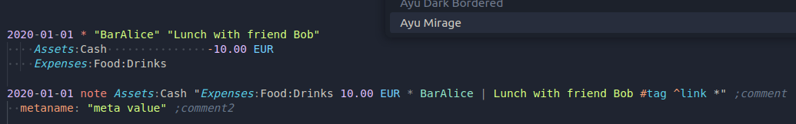
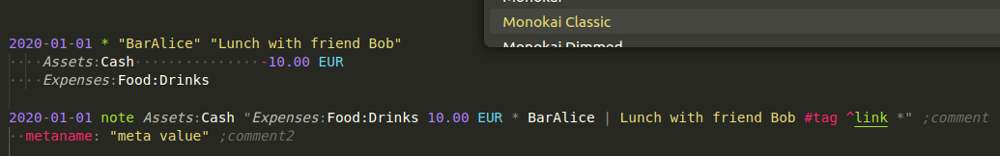
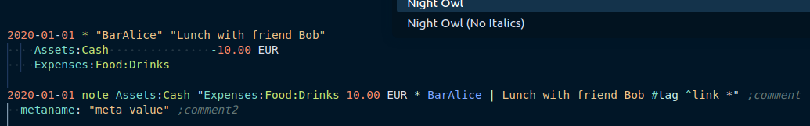

[](https://pypi.org/project/beancount-oneliner/)
[](https://pypistats.org/packages/beancount-oneliner)


## How to use

Fit a simple 2-leg transaction on **one line**.

```bean
1999-12-31 note Assets:Cash "Expenses:Test 16.18 EUR * A description. *"
```

That will be translated by the plugin to

```bean
1999-12-31 * "A description."
	Assets:Cash         -16.18 EUR
	Expenses:Test        16.18 EUR
```

It supports payee, exclamation mark, tags, links, meta, cost and price.

Recommended VSCode themes:
- Ayu
- Monokai Pro
- Night Owl






## Install

### Plugin

```sh
pip3 install beancount_oneliner --user
```

Or copy to path used for python. For example, `$HOME/.local/lib/python3.4/site-packages/beancount_oneliner/oneliner.py` would do on Debian. If in doubt, look where `beancount` folder is and copy next to it.


### Syntax highlight

Supported by the following beancount extensions:
- [beancount syntax definition for Sublime Text](https://github.com/draug3n/sublime-beancount)
- [VSCode Beancount Extension](https://github.com/Lencerf/vscode-beancount)

On VSCode, you will need to select the syntax with plugin support (there are two, with and without). To ensure it's selected automatically, add this to VSCode settings:
```jsonc
    "files.associations": {
        "*.bean": "beancount-oneline",
        "*.beancount": "beancount-oneline",
    }
```
